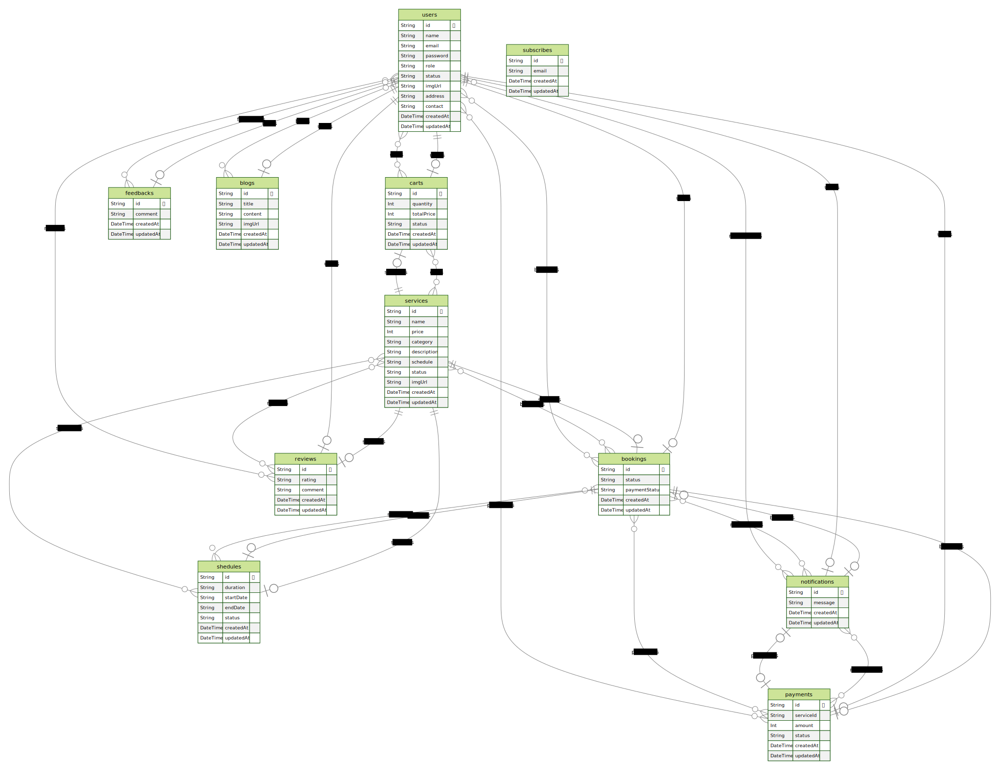

# This project is for Painting Booking and Management Service

## Description

This <em>Painting Booking and Management Service</em> is a backend boilerplate for Node.js, Express.js, and Prisma ORM. It is a comprehensive online platform backend project that allows users to book services and manage their bookings. It is built with Node.js, Express.js, and Prisma ORM. It also includes authentication, authorization, and role-based access control.

### Features

- [x] Implemented CRUD operations
- [x] Implemented Authentication and Authorization
- [x] Implemented Pagination and Filtering
- [x] Implemented $transaction for logical groups of processing data in Mongodb that needs to encapsulate several operations.
- [x] Implemented Zod for validation
- [x] Implemented JWT for authentication
- [x] Implemented Bcrypt for hashing password
- [x] Implemented Prisma for ORM
- [x] Implemented Typescript for type checking

### Technologies Used

- [x] Express.js
- [x] Typescript
- [x] PostgresSQL
- [x] Prisma
- [x] Zod
- [x] JWT
- [x] Bcrypt

### Entity Relationship Diagram

#### API Endpoints

#### User

- [x] Create User `POST /api/v1/auth/signup` [ Only User ]
- [x] Login User `POST /api/v1/auth/login` [ All users ]
- [x] Get All Users `GET /api/v1/users/all-users` [ Only Admin and Super Admin ]
- [x] Get User By Id `GET /api/v1/users/profile/:id` [ Only exact user ]
- [x] Update User By Id `PATCH /api/v1/users/update-profile/:id` [ Only exact user ]
- [x] Delete User By Id `DELETE /api/v1/users/delete-profile/:id` [ Only Admin and Super Admin ]

#### Admin

- [x] Update User By Id `PATCH /api/v1/admins/update-user/:id` [ Only Admin can update any user for it's permission field ]

#### Super Admin

- [x] Create Admin `POST /api/v1/super-admins/createAdmin` [ Only Super Admin ]
- [x] Update User By Id `PATCH /api/v1/super-admins/update-user/:id` [ Super Admin can update any user data without password ]

#### Painting Service

- [x] Create Service `POST /api/v1/services/create-service` [ Only Admin and Super Admin ]
- [x] Get All Services `GET /api/v1/services/all-services` [ All users ]
- [x] Get Service By Id `GET /api/v1/services/:id` [ All users ]
- [x] Update Service By Id `PATCH /api/v1/services/update-service/:id` [ Only Admin and Super Admin ]
- [x] Delete Service By Id `DELETE /api/v1/services/delete-service/:id` [ Only Admin and Super Admin ]

#### Cart

- [x] Create Cart `POST /api/v1/carts/create-cart` [ Only User ]
- [x] Get All Carts `GET /api/v1/carts/all-carts` [ Only Admin and Super Admin ]
- [x] Get Cart By Id `GET /api/v1/carts/:id` [ All users ]
- [x] Update Cart By Id `PATCH /api/v1/carts/update-cart/:id` [ Only Admin and Super Admin ]
- [x] Delete Cart By Id `DELETE /api/v1/carts/delete-cart/:id` [ All users ]

#### Booking

- [x] Create Booking `POST /api/v1/bookings/create-booking` [ Only User ]
- [x] Get All Bookings `GET /api/v1/bookings/all-bookings` [ Only Admin and Super Admin ]
- [x] Get Booking By Id `GET /api/v1/bookings/:id` [ All users ]
- [x] Update Booking By Id `PATCH /api/v1/bookings/update-booking/:id` [ Only Admin and Super Admin ]
- [x] Delete Booking By Id `DELETE /api/v1/bookings/delete-booking/:id` [ All users ]

Happy coding!